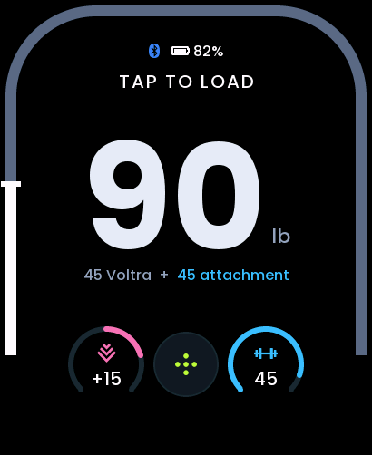
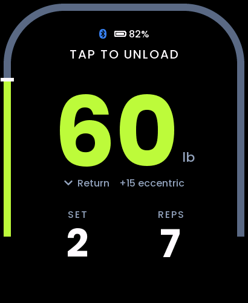
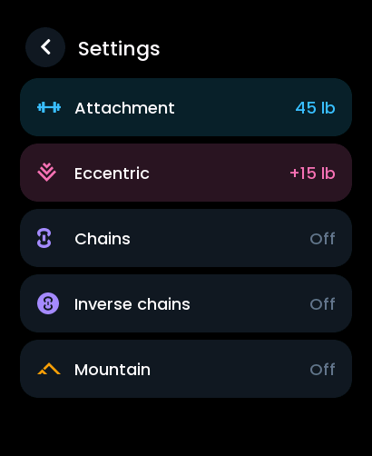
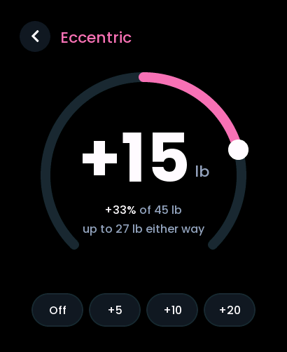
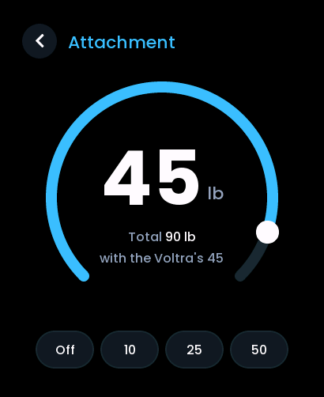
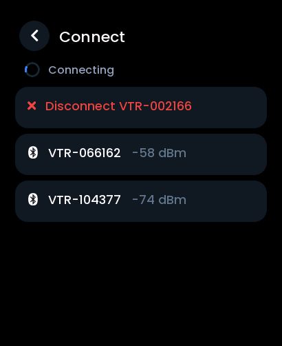

# Voltra Watch

Bar remote for a Beyond Power VOLTRA I on the Waveshare **ESP32-S3-Touch-AMOLED-2.06** watch.

Not affiliated with Beyond Power or Waveshare.

A port of [kirby6365/voltra_remote](https://github.com/kirby6365/voltra_remote) (MIT), the
Voltra remote for the Waveshare ESP32-S3-Knob-Touch-LCD-1.8, to the 2.06" watch. The knob
build is kept alongside. Protocol work builds on Omar Shahine's
[voltra-knob](https://github.com/omarshahine/voltra-knob), dylanmaniatakes'
Beyond-Power-HomeAssistant / Beyond-Power-Voltra-Android and jpamorgan's voltra-sdk.

<table>
<tr>
<td align="center"><br>Ready to load</td>
<td align="center"><br>During a set</td>
<td align="center"><br>Settings</td>
</tr>
<tr>
<td align="center"><br>Eccentric</td>
<td align="center"><br>Attachment</td>
<td align="center"><br>Connect</td>
</tr>
</table>

Screenshots come straight off the watch (`tools/screenshot.py`).

## What it does

| Gesture | Action |
|---|---|
| Tap the weight | Load if unloaded |
| Tap anywhere while loaded | Unload |
| Hold the weight | Voltra auto load (pull and hold the cable, 3 s countdown) |
| Tap again on "CABLE OUT: TAP TO OVERRIDE" | Load at once with the cable pulled out |
| Swipe up / down | Weight +/- 1 lb, 5 lb steps when swiping fast |
| Gear button | Settings: attachment, eccentric, chains, inverse chains, mountain, pulley, drop sets |
| Tap an accessory dial under the weight | Adjust that accessory |
| Tap the Bluetooth bar at the top | Connect screen: connect one or two Voltras, pair, un-twin |
| Two Voltras connected: tap the other one in the top bar | Control that Voltra |

The rail around the screen edge shows the weight: white while unloaded, green while loaded.
With eccentric on, the weight follows each rep: the base weight on the pull, and base
plus eccentric on the way back (from the second rep, once the Voltra knows the rep
length). The line under the weight says which.

**Attachment** (0 to 50 lb) is the weight of whatever hangs on the cable, such as a bar. It
is added to the weight on screen but never sent to the Voltra: with a 50 lb attachment and
the Voltra at 30 lb, the screen shows 80 lb. It is remembered across restarts.

**Pulley** (1:1, 2:1 or 0.5:1; tap the row to step through them) is for a pulley between
the Voltra and the handle. It is also display only: at 2:1 the weight, the live force and
the eccentric on the way back show what the handle carries, twice the Voltra's, and the
ratio shows over the unit. 0.5:1 halves them. The Voltra is still sent its own weight.
One setting for both Voltras, remembered across restarts.

**Drop sets** lower the weight by a percent of itself during a load, the way
[marvaments/voltra-knob-controller](https://github.com/marvaments/voltra-knob-controller)
does. On the Drop sets screen (Settings), tap a row to step through its values:

- **Mode**: off, **rep target** (drop after every so many reps of a set: with 8, after
  reps 8, 16...) or **set down** (drop each time a set ends and the Voltra rests).
- **Drops**: 1 to 4 per load. Loading again starts them over.
- **Drop by**: 5 to 50% of the weight at the time, so 100 lb at 20% goes to 80, then 64.
- **Every**: 2 to 20 reps, for rep target.

Only the weight drops; chains and eccentric stay as they are. A drop during a set keeps
the set going, and the knob clicks twice. During a set, the line under the
weight shows how many drops have been made. One setting for both Voltras, remembered
across restarts.

The watch switches itself off after 10 minutes without a touch, unless the Voltra is
loaded or the watch is plugged in. The side button turns it back on.

## What you need

- Waveshare **ESP32-S3-Touch-AMOLED-2.06** (the ESP32-S3 version, not the C6), either:
  - [the watch on its own](https://www.amazon.ca/dp/B0FJFNXGNX), or
  - [the watch with a battery](https://www.amazon.ca/gp/product/B0FJFP6VLJ)
- For running unplugged, if your watch came without one: a 3.7 V LiPo with an MX1.25
  plug, such as [this one](https://www.amazon.ca/dp/B08215N9R8). **Its plug is wired the
  other way round and has to be re-pinned first** (see step 4).
- A USB-C data cable
- A Mac, Linux or Windows computer

## Load it onto a new watch

### 1. Install PlatformIO

Either the [PlatformIO extension for VS Code](https://platformio.org/install/ide?install=vscode),
or the command line:

```
brew install platformio        # macOS
pip install platformio         # anywhere with Python 3
```

### 2. Get the code

```
git clone https://github.com/stevenpoint/voltra_remote.git
cd voltra_remote
```

### 3. Flash the watch

Plug the watch in over USB-C, then:

```
pio run -e watch206 -t upload
```

The first build downloads the ESP32 toolchain and libraries, which takes a few minutes.
The watch restarts into the remote when the upload finishes.

If the upload cannot find the watch, hold the **BOOT** button while plugging it in, release
it once the port appears, and upload again.

Use only the `watch206` build on the watch. The `remote` build is for the knob and uses
different pins (GPIO 8 is the watch's display reset).

### 4. Fit the battery (optional)

**Check the polarity before plugging a battery in.** The red wire must go to the **+** pad
marked on the board. Aftermarket batteries with the same plug are sometimes wired the other
way round, including the one linked above; a reversed battery is not detected and the
watch will not run unplugged (and it risks damaging the board).

To swap a reversed plug: with a pin, gently lift the small plastic latch over each metal
contact on the plug and slide the wire out, then push the two wires back in on the
opposite sides until they click. Keep the bare contacts from touching each other while
they are out.

The watch charges the battery over USB-C. Its level shows at the bottom of the screen.

### 5. Connect to your Voltra

1. Close **Beyond+** on your phone first. The Voltra only keeps one controller.
2. On the watch, tap the Bluetooth bar at the top to open the Connect screen.
3. Tap your Voltra (`VTR-...`) in the list.

The watch starts up unconnected each time: connect from the Connect screen when you want
to. If the link drops during a session, it reconnects by itself. It never loads the Voltra
on its own.

To use two Voltras, connect the second from the Connect screen too. The top bar then shows
both; tap the other one to control it. Each keeps its own weight, accessories and
attachment.

## Twin mode

Twin the Voltras **from the watch**, not from the Voltras' own screens: a hosting Voltra
stops advertising, so a remote can only drive the pair over a connection it made before
twinning (the way Beyond+ does it; see `docs/PROTOCOL.md`, "Twin mode").

1. Connect to the Voltra that should host (the one you are controlling, if both are
   connected).
2. Open the Connect screen and tap **Pair VTR-... + VTR-...** (both connected) or
   **Twin with VTR-...** under the other Voltra. With both connected, the watch lets go of
   the other first: a Voltra will not join a twin while the watch is connected to it.
3. The watch goes back to the main screen, and the top bar shows **TWIN** and both Voltras' batteries (host first); weight, load,
   unload and the cable-out override now drive both, and the weight shows the pair's total.
4. **Un-twin** on the Connect screen undoes it. If both were connected before pairing, the
   watch reconnects to the second by itself.

If the watch loses the host while twinned it keeps retrying; reconnecting can take a
minute or so, and if it does not, un-twin on the Voltras and set the twin up again.

## On the knob

The same code also builds for the Waveshare
[ESP32-S3-Knob-Touch-LCD-1.8](https://www.waveshare.com/wiki/ESP32-S3-Knob-Touch-LCD-1.8),
the board the original remote was made for. Turning the knob does what swiping does on the
watch: 1 lb steps turned slowly, 5 lb steps spun fast. The knob keeps the original
remote's screen layout. The Voltra code is the same on both, so twin mode, two Voltras
at once and the Connect screen work there too: tap the top of the screen to open it.
Drop sets are the **DROP SETS** button at the top of the Settings screen.

On Windows, one command in PowerShell installs what it needs (Python, Git, PlatformIO), downloads
the code, flashes the knob and offers to take screenshots of every screen:

```
irm https://raw.githubusercontent.com/stevenpoint/voltra_remote/watch206/tools/install_knob.ps1 | iex
```

Otherwise follow steps 1, 2 and 5 above, with this in place of step 3:

```
pio run -e remote -t upload
```

The knob has two chips behind a USB switch. If the computer sees a CH340 serial port
rather than an Espressif USB device (`303A:1001`), flip the USB-C plug over.

On Windows, build from PowerShell or cmd, not Git Bash: the toolchain does not install
under MSYS, and the build then fails with `'xtensa-esp32s3-elf-gcc' is not recognized`.

## Safety

- The watch only loads when you tap, hold or confirm the override. It never loads on
  start-up or after reconnecting.
- If Bluetooth drops, the watch shows it is disconnected and leaves the Voltra as it is.
- The cable-out override loads at once with the cable pulled out, skipping the Voltra's own
  hold-still check. Use it with a firm grip.
- Straps and printed parts are not a failsafe. Unload from the Voltra itself if anything
  feels wrong.

## Code layout

```
src/main.cpp              start-up
src/hw/                   display (display_watch206.cpp on the watch), touch, battery,
                          knob (swipes stand in for it on the watch)
src/ui/ui.cpp             screens; WATCH206 sections hold the watch layout
src/voltra/               BLE client and protocol (voltra_protocol.* is host-tested)
src/diag/flash_log.*      diagnostic builds: keeps the log in flash
docs/PROTOCOL.md          the Voltra protocol, including cable-out and twin captures
tools/                    font and icon generators, pull_log.py
```

Builds, from `platformio.ini`:

| Build | For |
|---|---|
| `watch206` | The watch |
| `watch206_diag` | The watch, logging all Voltra traffic to flash |
| `watch206_sweep` | As `watch206_diag`, plus a full register read every ~40 s |
| `remote` / `remote_diag` | The original knob |
| `native` | Protocol unit tests: `pio test -e native` |

To capture Voltra traffic away from a computer, flash `watch206_diag`, use the watch at
the Voltra, then plug it back in and run:

```
~/.platformio/penv/bin/python tools/pull_log.py
```

This saves the log to `voltra_capture.log`; `--clear` wipes it from the watch afterwards.
